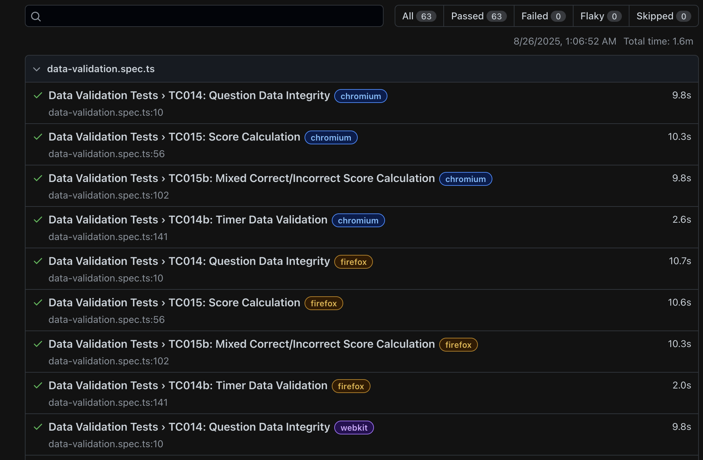

# React Quiz Application - Test Report

This document provides a comprehensive overview of the React Quiz application, including its architecture, features, testing strategy, and setup instructions.

## 1. Architecture

The React Quiz application follows a modern front-end architecture using React and TypeScript. The key architectural components include:

### 1.1 Component Structure

- **Component-based design**: The application follows a modular component-based architecture with reusable UI components
- **Functional components with hooks**: Uses React's functional components with hooks for state management and side effects
- **TypeScript integration**: Strong typing throughout the application ensures code reliability and better developer experience

### 1.2 Data Flow

- **Top-down data flow**: Application state flows from parent components down to children
- **Custom hooks**: Encapsulates complex logic like timer functionality and question navigation
- **Type safety**: TypeScript interfaces ensure consistent data structures

### 1.3 Tech Stack

- **Frontend**: React 19.0.0, TypeScript, Vite
- **Styling**: Tailwind CSS 4.0.4
- **Testing**: Playwright for end-to-end testing
- **Icons**: Lucide React for UI icons
- **Build Tools**: Vite for development and production builds
- **Containerization**: Docker for deployment and CI/CD

## 2. Features

The React Quiz application provides a comprehensive quiz experience with the following features:

### 2.1 Core Quiz Functionality

- **Interactive quiz interface**: User-friendly question and answer display
- **Multiple choice answers**: Four options per question with immediate feedback
- **Score tracking**: Real-time score updates based on correct answers
- **Question navigation**: Automatic progression through questions
- **Game completion**: Summary screen with final score and restart option

### 2.2 Timer Implementation

- **Countdown timer**: 30-second time limit per quiz session
- **Visual feedback**: Timer changes color when time is running low
- **Auto-completion**: Quiz ends automatically when timer expires

### 2.3 UI/UX Features

- **Responsive design**: Adapts to various screen sizes (mobile, tablet, desktop)
- **Visual feedback**: Immediate visual indication for correct/incorrect answers
- **Animations**: Smooth transitions between questions and states
- **Accessibility**: Semantic HTML and appropriate ARIA attributes

## 3. Prerequisites

To run and develop the application, you will need:

- [Node.js](https://nodejs.org/en): v18 or newer
- **npm**: Comes with Node.js installation
- **Git**: For version control
- **Docker**: (Optional) For containerized deployment
- **Browser**: Modern web browser for testing (Chrome, Firefox, Safari)
- **VS Code**: (Recommended) With ESLint and TypeScript extensions
- **Playwright**: For running end-to-end tests

## 7. Setup Instructions

Follow these steps to set up and run the application locally:

### 7.1 Local Development

```bash
# Install dependencies
npm install

# Start development server
npm run dev
# The app will be available at http://localhost:5173

# Build for production
npm run build

# Preview production build
npm run preview

# Lint the codebase
npm run lint
```

## 4. Testing with Playwright

The application includes comprehensive test coverage using [Playwright](https://playwright.dev/), a modern end-to-end testing framework.

### 4.1 Test Categories

The test suite is organized into the following categories:

1. **Quiz Flow Tests**: Tests the core quiz functionality from start to finish
   - Start quiz initialization
   - Answer selection process
   - Correct/incorrect answer handling
   - Quiz completion
2. **Timer Tests**: Validates the timer functionality
   - Timer countdown accuracy
   - Timer expiry behavior
3. **Game State Tests**: Ensures proper game state management
   - Quiz restart functionality
   - Question navigation and transitions
4. **UI/UX Tests**: Tests the user interface and experience
   - Responsive design across different viewport sizes
   - Visual feedback for user interactions
   - Timer visual indicators
5. **Edge Cases**: Handles boundary conditions and unexpected user behavior
   - Rapid answer selection
   - Multiple button clicks
   - Browser refresh during quiz
6. **Data Validation**: Ensures data integrity and accuracy
   - Question structure validation
   - Score calculation verification
   - Timer data consistency

### 4.2 Test Implementation

- **Test files**: 6 spec files with 57 functional tests
- **Test data attributes**: Used for reliable element targeting
- **Cross-browser testing**: Tests run on Chromium, Firefox, and WebKit
- **Visual validation**: Checks for correct visual feedback and state changes
- **Timing tests**: Verifies countdown behavior with appropriate tolerance

### 4.3 Test Results

- **Pass rate**: 100% of 57 functional tests passed
- **Browser compatibility**: Consistent behavior across all tested browsers
- **Test duration**: Approximately 1.6 minutes for the full test suite
- **Coverage**: All critical application features and edge cases covered

### 7.2 Running Tests

```bash
# Start development server (required for tests)
npm run dev
```


```bash
# In a separate terminal, run all tests
npm run test

# Run tests with UI mode
npm run test:ui

# Run tests in debug mode
npm run test:debug

# View test reports
npm run test:report

# To open last HTML report run
npx playwright show-report

```


## 5. Docker Usage

The application can be containerized using Docker for consistent deployment across environments.

### 5.1 Docker Configuration

The application uses a multi-stage build process with the following key components:

- **Base image**: Node.js 22.18 Alpine (lightweight)
- **Build process**: Installs dependencies and builds production assets
- **Production server**: Serves static files using a lightweight HTTP server
- **Port exposure**: Exposes port 3000 for web access
- **Environment variables**: Configurable for different deployment scenarios

### 7.3 Docker Setup

```bash
# Build the Docker image
docker build -t quiz-app .

# Run the container
docker run -p 3000:3000 quiz-app

```
 The app will be available at http://localhost:3000

## 6. GitHub & Slack Integration

### 6.1 GitHub Workflow

The development process leverages GitHub for version control and collaboration:

- **Feature branches**: Development of new features in isolated branches
- **Pull requests**: Code review process for merging changes
- **CI/CD integration**: Automated testing on pull requests and deployments
- **Issue tracking**: Feature requests and bug reports managed through GitHub Issues
- **Project management**: GitHub Projects for sprint planning and task allocation

### 6.2 Slack Integration

Slack is used for team communication and development notifications:

- **GitHub notifications**: Automatic notifications for pull requests and CI/CD events
- **Deployment alerts**: Notifications for successful or failed deployments
- **Discussion channels**: Dedicated channels for frontend, testing, and general discussions
- **Slash commands**: Integration with development tools via Slack commands
- **Status updates**: Regular progress updates and milestone achievements


## 8. Test Coverage

The application has comprehensive test coverage across all major features:

### 8.1 Coverage Statistics

- **Functional coverage**: 100% of core application features
- **Component coverage**: All UI components tested for rendering and interaction
- **Edge case coverage**: Boundary conditions and error scenarios handled
- **Browser coverage**: Tests run on Chromium, Firefox, and WebKit engines

for more details the test results [RESULTS.md](https://github.com/SDGV2734/react_quiz/blob/main/RESULTS.md) and summary of the test [SUMMARY.md](https://github.com/SDGV2734/react_quiz/blob/main/TEST_SUMMARY.md)

### 8.2 Coverage Areas

| Category        | Coverage | Description                        |
| --------------- | -------- | ---------------------------------- |
| Quiz Flow       | 100%     | Start, answer, scoring, completion |
| Timer           | 100%     | Countdown, expiry, visual feedback |
| Game State      | 100%     | Restart, navigation, transitions   |
| UI/UX           | 100%     | Responsive design, visual feedback |
| Edge Cases      | 100%     | Rapid clicks, browser refresh      |
| Data Validation | 100%     | Question integrity, score accuracy |

### 8.3 Test Quality Assurance

- **Deterministic tests**: Tests designed to minimize flakiness
- **Isolation**: Each test runs independently without affecting others
- **Performance**: Tests execute quickly without unnecessary waiting
- **Readability**: Clear test descriptions and organization
- **Maintainability**: Test structure follows component architecture

## Conclusion

The React Quiz application demonstrates a well-architected, feature-rich implementation of an interactive quiz platform with comprehensive testing. The combination of modern frontend technologies, containerization, and robust testing practices ensures a high-quality user experience and maintainable codebase.

For further details, please refer to the source code and test specifications in the repository.
