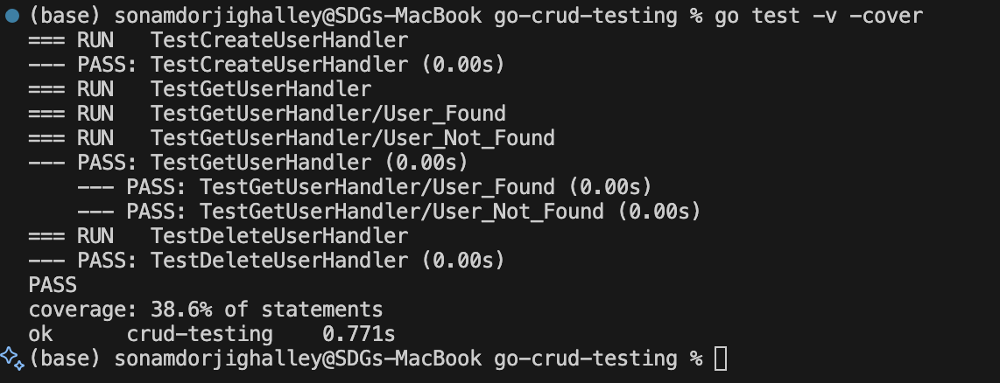
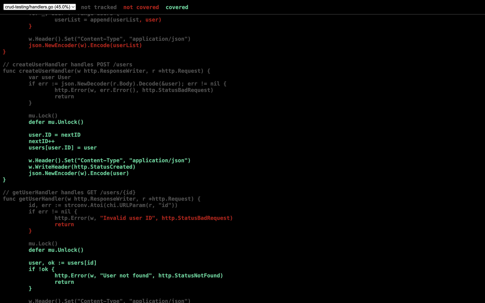

# Go CRUD Testing

This project demonstrates a simple CRUD (Create, Read, Update, Delete) API in Go, along with unit tests and code coverage analysis. It is designed as a learning resource for Go web development and testing best practices.

## Features

- RESTful API for basic CRUD operations
- Handlers implemented in Go
- Unit tests for all handlers
- Code coverage reporting

## Project Structure

- `main.go`: Entry point of the application, sets up the HTTP server and routes.
- `handlers.go`: Contains the handler functions for CRUD operations.
- `handlers_test.go`: Unit tests for the handler functions.
- `go.mod` / `go.sum`: Go module files for dependency management.
- `coverage.out`: Code coverage output file generated by tests.

## Running the Application

To start the server:

```sh
go run main.go
```

## Running Tests

To run all tests with verbose output and generate a coverage report:

```sh
go test -v -cover
```

To generate an HTML coverage report:

```sh
 go tool cover -html=coverage.out

```
## Output
From Terminal output


From UI of code coverage


## How It Works

- The API exposes endpoints for creating, reading, updating, and deleting resources.
- Handlers are tested using Go's standard `testing` package.
- Code coverage tools are used to ensure all logic is tested.


### **Repo Link** 

[click here to view the full code](https://github.com/SDGV2734/go-crud-testing-.git)