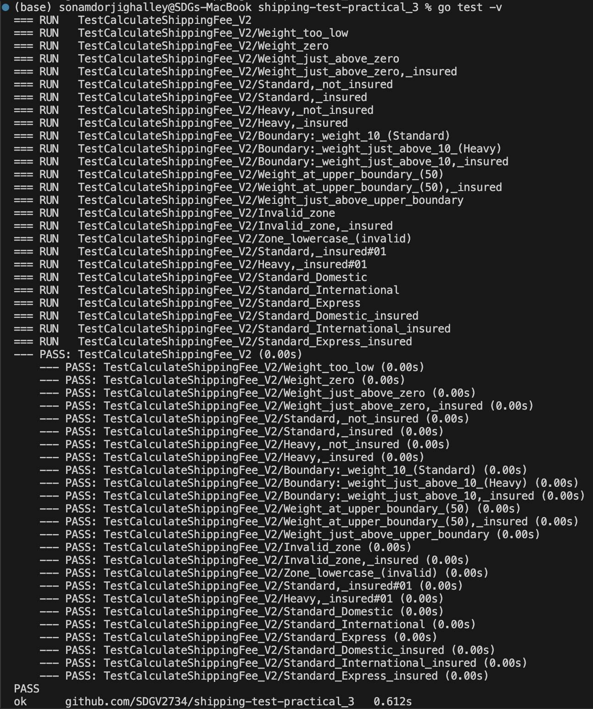

# Software Testing Practical 3: Specification-Based Testing with Equivalence Partitions and Boundary Values

## Key Concepts Covered

### Specification-Based Testing

Tests are designed based on the requirements/specifications, not the implementation. This ensures that the software behaves as expected from a user's perspective.

### Equivalence Partitioning

The input space is divided into partitions (groups) where the system should behave similarly. By testing one value from each partition, you minimize the number of test cases while maximizing coverage.

### Boundary Value Analysis (BVA)

Special attention is given to values at the edges of partitions, as these are common sources of bugs (e.g., off-by-one errors).

### Decision Table Testing

All possible combinations of inputs and their expected outcomes are systematically tested, ensuring thorough coverage of business rules.

### Systematic, Critical Thinking

Testing is planned and methodical, preventing random/ad hoc approaches. This leads to robust, comprehensive test suites.

---

## Shipping Fee V2: Partitions & Boundaries

### Equivalence Partitions

#### Weight

- **Invalid (≤ 0):** Examples: -5, 0
- **Valid Standard (0 < w ≤ 10):** Examples: 1, 10
- **Valid Heavy (10 < w ≤ 50):** Examples: 20, 50
- **Invalid (> 50):** Examples: 51, 100

#### Zone

- **Valid Zones:** "Domestic", "International", "Express"
- **Invalid Zones:** "Local", "", "domestic" (case sensitive)

#### Insured

- **Not Insured:** false
- **Insured:** true

### Boundary Values

#### Weight

- **Lower boundary:** 0 (invalid), 0.01 (just valid)
- **Mid boundary:** 10 (last Standard), 10.01 (first Heavy)
- **Upper boundary:** 50 (valid), 50.01 (invalid)

#### Zone

- Not numerical; test all valid zones and at least one invalid zone.

#### Insured

- Boolean; test both `true` and `false` values.

---

## Why Use These Test Cases?

- **Equivalence Partitions:** Ensure all types of input are covered, verifying general system behavior.
- **Boundary Values:** Detect edge-case and off-by-one errors, which are common in real-world bugs.
- **Combined Approach:** Results in a robust, requirement-driven test suite that maximizes coverage and reliability.

---

## Decision Table for Shipping Fee V2

This table summarizes the main test cases used for the shipping fee calculation, covering different combinations of weight, zone, and insurance status.

| Test Case Name                      | Weight | Zone          | Insured | Expected Fee | Expect Error |
| ----------------------------------- | ------ | ------------- | ------- | ------------ | ------------ |
| Weight too low                      | -5     | Domestic      | false   | 0            | true         |
| Weight zero                         | 0      | Domestic      | false   | 0            | true         |
| Weight just above zero              | 0.01   | Domestic      | false   | 5.00         | false        |
| Weight just above zero, insured     | 0.01   | Domestic      | true    | 5.08         | false        |
| Standard, not insured               | 10     | International | false   | 20.00        | false        |
| Standard, insured                   | 10     | International | true    | 20.30        | false        |
| Heavy, not insured                  | 20     | Express       | false   | 37.50        | false        |
| Heavy, insured                      | 20     | Express       | true    | 38.06        | false        |
| Boundary: weight 10 (Standard)      | 10     | Domestic      | false   | 5.00         | false        |
| Boundary: weight just above 10      | 10.01  | Domestic      | false   | 12.50        | false        |
| Boundary: weight just above 10, ins | 10.01  | Domestic      | true    | 12.69        | false        |
| Weight at upper boundary (50)       | 50     | International | false   | 27.50        | false        |
| Weight at upper boundary (50), ins  | 50     | International | true    | 27.91        | false        |
| Weight just above upper boundary    | 50.01  | Express       | false   | 0            | true         |
| Invalid zone                        | 10     | Local         | false   | 0            | true         |
| Invalid zone, insured               | 10     | Unknown       | true    | 0            | true         |
| Zone lowercase (invalid)            | 10     | domestic      | false   | 0            | true         |
| Standard, insured                   | 5      | Domestic      | true    | 5.08         | false        |
| Heavy, insured                      | 25     | International | true    | 27.91        | false        |
| Standard Domestic                   | 1      | Domestic      | false   | 5.00         | false        |
| Standard International              | 1      | International | false   | 20.00        | false        |
| Standard Express                    | 1      | Express       | false   | 30.00        | false        |
| Standard Domestic insured           | 1      | Domestic      | true    | 5.08         | false        |
| Standard International insured      | 1      | International | true    | 20.30        | false        |
| Standard Express insured            | 1      | Express       | true    | 30.45        | false        |

- **Fee values** are rounded to two decimal places for clarity.
- **Expect Error** is true if the input is invalid and the function should return an error.

## Submission Checklist

- [x] Screenshot of all tests passing

-  All code files: `shipping_v2.go`, `shipping_v2_test.go` 

[HERE!!](https://github.com/SDGV2734/SWE302_shipping_test_practical_3.git)
