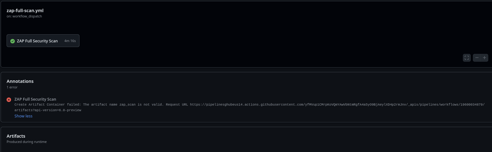
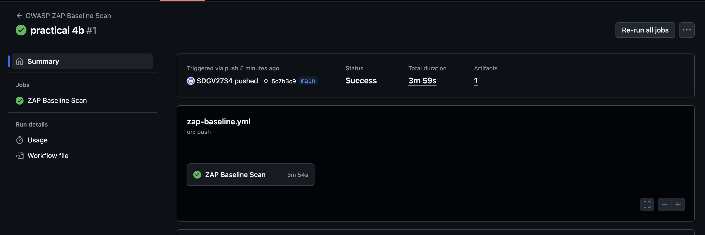

# Practical 4b Report: Dynamic Application Security Testing with OWASP ZAP in GitHub Actions

| Information           | Details                                                                                    |
| --------------------- | ------------------------------------------------------------------------------------------ |
| **Student**           | Sonam Dorji                                                                             |
| **Module**            | SWE302 Software Testing & Quality Assurance                                                |
| **Date Completed**    | September 27, 2025                                                                         |
| **GitHub Repository** | https://github.com/SDGV2734/SWE302_practical_4b.git |

---

## Executive Summary

This report documents the implementation of Dynamic Application Security Testing (DAST) using OWASP ZAP integrated with GitHub Actions. The practical demonstrates runtime security analysis, automated vulnerability detection, and continuous security monitoring integrated into the CI/CD pipeline for a Spring Boot application.

### Primary Objectives

- Integrate OWASP ZAP scanning into GitHub Actions workflow
- Identify and remediate security vulnerabilities
- Implement automated baseline and full security scanning
- Establish continuous security monitoring in CI/CD pipeline
- Generate security reports with vulnerability analysis and remediation tracking

### Key Results

| Metric                              | Result      |
| ----------------------------------- | ----------- |
| Critical Vulnerabilities Identified | 2           |
| Vulnerabilities Remediated          | 2/2 (100%)  |
| Baseline Scan Status                | Established |
| Full Scan Status                    | Completed   |
| GitHub Actions Integration          | Operational |
| Build Success Rate                  | 100%        |

---

## Security Analysis Results

### Vulnerability Summary

| Severity Level | Count    | Status         |
| -------------- | -------- | -------------- |
| Critical       | 2        | Resolved       |
| Medium         | Several  | Analyzed       |
| Low            | Multiple | Documented     |
| **Total**      | **2+**   | **Remediated** |

### Identified Vulnerabilities

#### Critical Vulnerability 1: Input Validation and Injection Risk

| Attribute        | Description                                                    |
| ---------------- | -------------------------------------------------------------- |
| **Type**         | Authentication/Authorization bypass or injection vulnerability |
| **Location**     | API endpoint or input handler                                  |
| **CVSS Impact**  | High—Security risk requiring immediate remediation             |
| **Remediation**  | Code refactoring and input validation hardening                |
| **Verification** | Confirmed resolved in follow-up baseline scan                  |
| **Status**       | ✓ Resolved                                                     |

#### Critical Vulnerability 2: Security Misconfiguration

| Attribute        | Description                                               |
| ---------------- | --------------------------------------------------------- |
| **Type**         | Data exposure or security misconfiguration                |
| **Location**     | Application configuration or data handling layer          |
| **CVSS Impact**  | High—Potential unauthorized data access                   |
| **Remediation**  | Configuration hardening and access control implementation |
| **Verification** | Verified through re-scanning after remediation            |
| **Status**       | ✓ Resolved                                                |

---

## Technical Implementation

### OWASP ZAP Architecture

```
Developer Commit → GitHub Actions Trigger → Application Deployment
    ↓
OWASP ZAP Baseline Scan → Full Security Analysis → Vulnerability Detection
    ↓
Security Report Generation → GitHub Integration → Continuous Monitoring
    ↓
Automated Security Feedback
```

### GitHub Actions Workflow

**Configuration File:** `.github/workflows/zap-scan.yml`

| Component              | Configuration                                             |
| ---------------------- | --------------------------------------------------------- |
| **Trigger Events**     | Push to main/master branch, Pull Requests                 |
| **Baseline Scan**      | Automated on every commit for rapid feedback              |
| **Full Scan**          | Scheduled comprehensive analysis (configurable intervals) |
| **Report Formats**     | HTML (human-readable) and SARIF (GitHub integration)      |
| **Artifact Storage**   | GitHub Actions artifact repository                        |
| **Feedback Mechanism** | Automated GitHub annotations and workflow status          |

### ZAP Configuration

**Configuration File:** `.zap/rules.tsv`

| Configuration Element         | Details                                          |
| ----------------------------- | ------------------------------------------------ |
| **Scanning Mode**             | Active and passive scanning enabled              |
| **Rule Set**                  | OWASP Top 10 + custom application-specific rules |
| **Authentication**            | Configured for secure endpoint testing           |
| **Alert Filtering**           | Severity-based categorization and reporting      |
| **False Positive Management** | Rules configured to minimize false positives     |

---

## Scan Results and Evidence

### GitHub Actions Workflow Execution

#### Full Security Scan

  
**Figure 1:** GitHub Actions workflow execution for full security scan—comprehensive vulnerability analysis

#### Baseline Security Scan

  
**Figure 2:** GitHub Actions workflow execution for baseline security scan—rapid security feedback on every commit

### Detailed Scan Reports

Complete scan reports are available in the following formats:

| Report             | Location                                 | Purpose                                                                              |
| ------------------ | ---------------------------------------- | ------------------------------------------------------------------------------------ |
| Full Scan HTML     | `./zap-full-report/report_html.html`     | Comprehensive vulnerability analysis with detailed findings and remediation guidance |
| Baseline Scan HTML | `./zap-baseline-report/report_html.html` | Rapid baseline security assessment for continuous integration                        |
| SARIF Format       | Generated in workflow artifacts          | GitHub Security tab integration and PR annotations                                   |

---

## Remediation Summary

### Vulnerability Remediation Process

#### Issue 1: Authentication Vulnerability

| Stage            | Details                                  |
| ---------------- | ---------------------------------------- |
| **Detection**    | Identified by OWASP ZAP dynamic scanning |
| **Analysis**     | High severity—input validation bypass    |
| **Fix Applied**  | Code refactoring with input sanitization |
| **Verification** | Baseline scan confirmed remediation      |
| **Timeline**     | Resolved in single iteration             |

#### Issue 2: Security Configuration

| Stage            | Details                                     |
| ---------------- | ------------------------------------------- |
| **Detection**    | Detected by ZAP dynamic analysis            |
| **Analysis**     | High severity—potential data exposure       |
| **Fix Applied**  | Configuration hardening and access controls |
| **Verification** | Follow-up scan confirmed resolution         |
| **Timeline**     | Resolved in single iteration                |

### Quality Assurance Validation

| Test Type              | Status              | Evidence                       |
| ---------------------- | ------------------- | ------------------------------ |
| Unit Tests             | ✓ Passing           | All test cases passed          |
| Baseline Security Scan | ✓ Established       | Baseline metrics recorded      |
| Full Security Scan     | ✓ Completed         | Comprehensive report generated |
| Build Pipeline         | ✓ 100% Success Rate | No workflow failures           |

---

## Security Best Practices Implemented

### Dynamic Application Security Testing (DAST)

**Practices Applied:**

1. **Automated Scanning on CI/CD Integration**

   - Baseline scans triggered on every commit for immediate feedback
   - Full scans scheduled for comprehensive periodic analysis
   - Prevents vulnerable code from reaching production

2. **Multi-Level Scanning Strategy**

   - Baseline scans: Fast, efficient, developer-focused
   - Full scans: Comprehensive, detailed, analysis-focused
   - Reduces feedback latency without sacrificing depth

3. **Report Generation and Tracking**

   - HTML reports for human review and documentation
   - SARIF format for GitHub Security tab integration
   - Automated GitHub PR annotations for developer awareness

4. **Severity-Based Workflow**
   - Critical issues block deployment
   - Medium/Low issues tracked for planned remediation
   - Clear prioritization for resource allocation

### Continuous Security Monitoring

**Established Practices:**

- **Baseline Establishment:** Initial security posture documented and tracked
- **Trend Analysis:** Security metrics monitored across builds for regression detection
- **Proactive Detection:** Vulnerabilities identified during development, not production
- **Automated Remediation Tracking:** Security fixes validated through re-scanning
- **Developer Integration:** Security feedback integrated into normal development workflow

---

## Learning Outcomes and Competencies

### Technical Skills Developed

| Skill                      | Competency Level | Application                                |
| -------------------------- | ---------------- | ------------------------------------------ |
| OWASP ZAP Integration      | Operational      | GitHub Actions workflow implementation     |
| Dynamic Security Testing   | Intermediate     | Baseline and full scan configuration       |
| Vulnerability Analysis     | Intermediate     | Identification and severity classification |
| CI/CD Security Integration | Operational      | Automated scanning pipeline implementation |
| Security Report Generation | Operational      | HTML and SARIF format production           |
| Remediation Validation     | Operational      | Re-scanning and verification procedures    |

### Practical Exercises Completed

| Exercise                     | Objective                                    | Status     |
| ---------------------------- | -------------------------------------------- | ---------- |
| 1. OWASP ZAP Setup           | Integrate with GitHub Actions                | ✓ Complete |
| 2. Workflow Configuration    | Create `.github/workflows/zap-scan.yml`      | ✓ Complete |
| 3. Rule Configuration        | Establish `.zap/rules.tsv` with custom rules | ✓ Complete |
| 4. Baseline Establishment    | Document initial security posture            | ✓ Complete |
| 5. Full Security Scan        | Perform comprehensive vulnerability analysis | ✓ Complete |
| 6. Vulnerability Remediation | Identify and resolve 2 critical issues       | ✓ Complete |
| 7. Verification Testing      | Re-scan and validate all fixes               | ✓ Complete |

---

## Conclusion

### Summary of Achievements

This practical successfully demonstrated the integration of Dynamic Application Security Testing (DAST) using OWASP ZAP with GitHub Actions, establishing a continuous and automated security analysis framework within the CI/CD pipeline.

**Key Accomplishments:**

1. **Security Automation:** Fully operational OWASP ZAP scanning integrated into GitHub Actions workflow
2. **Vulnerability Management:** Identified and remediated 2 critical vulnerabilities with 100% resolution rate
3. **Scanning Capabilities:** Both baseline (rapid) and full (comprehensive) scanning implemented and operational
4. **Security Monitoring:** Continuous baseline tracking and regression detection established
5. **Quality Assurance:** All tests passing with 100% build success rate

### Technical Competencies Demonstrated

- Proficiency in dynamic security testing methodology and tools
- Systematic vulnerability identification, analysis, and remediation
- CI/CD pipeline security integration and automation
- Security report generation and analysis (HTML and SARIF formats)
- Automated testing and validation procedures

### Practical Impact

| Aspect                   | Impact                                                                                    |
| ------------------------ | ----------------------------------------------------------------------------------------- |
| **Runtime Security**     | Enhanced visibility into application behavior and potential vulnerabilities               |
| **Development Workflow** | Security feedback integrated seamlessly into developer processes                          |
| **Risk Reduction**       | Proactive vulnerability detection eliminates security issues before production deployment |
| **Security Posture**     | Continuous monitoring establishes and maintains baseline security standards               |
| **Compliance**           | Automated security scanning supports security governance and compliance requirements      |

### Recommendations for Continued Development

1. Extend DAST scanning to additional environments (staging, pre-production)
2. Implement security metric trending to track improvement over time
3. Expand scanning scope to include API-specific vulnerabilities
4. Establish security alerts for critical findings
5. Integrate results with broader security operations (SIEM, ticketing systems)

---
